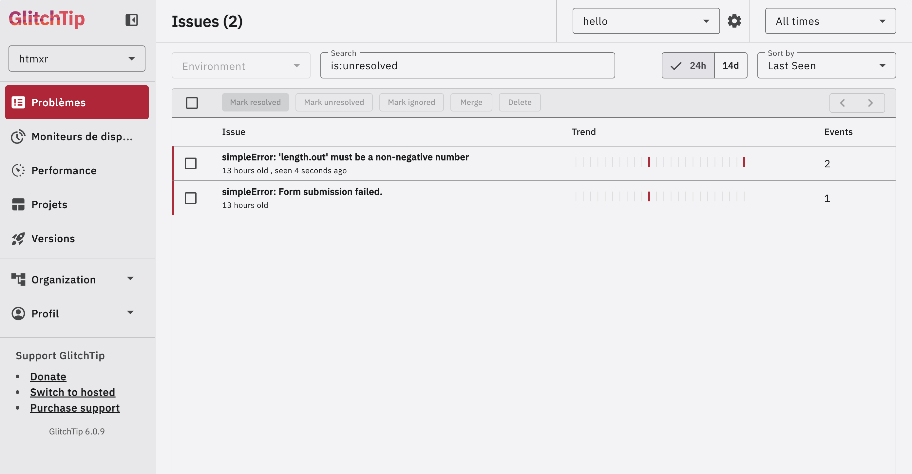
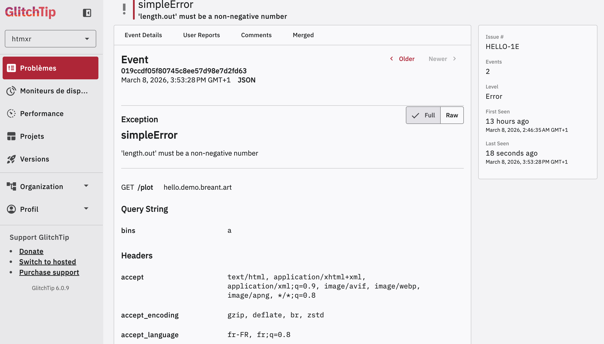
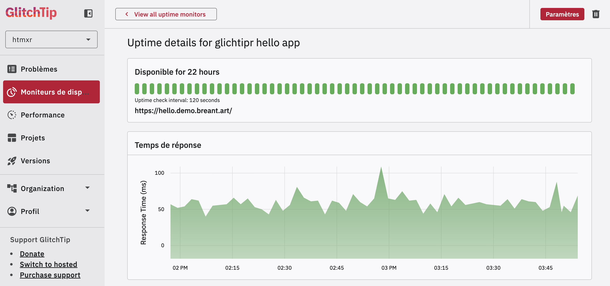

When an R error occurs in a production app, it disappears silently — unless
you've set up error tracking. **glitchtipr** sends errors to
[GlitchTip](https://glitchtip.com) with full context (endpoint, query string,
sanitised headers) so you can find and fix them without guessing.

GlitchTip is open source and self-hostable. It implements the Sentry store
API, so **glitchtipr** works with any Sentry-compatible platform.

---

## In the ecosystem

You build your app with **htmxr**. You ship it. Then what?

Without error tracking, production is a black box. A user hits `/plot` with
an unexpected parameter — R throws, plumber2 returns a 500, nobody knows.
With **glitchtipr**, that error lands in your dashboard with everything you
need to reproduce it.

---

## One annotation

**glitchtipr** ships with a `@capture` plumber2 tag. Add it above any route
— that's all it takes.

```r
library(glitchtipr)

gt <- gt_connect()  # reads GLITCHTIP_DSN from .Renviron

#* @capture
#* @get /plot
#* @parser none
#* @serializer none
function(request, query) {
  generate_plot(query$bins %||% 30)
}
```

`@capture` wraps the handler automatically. If it throws, the error is
reported to GlitchTip with full context — then re-raised so plumber2 handles
it normally.

---

## What you see

Errors are grouped by type and message. Each one shows its occurrence count
and when it was last seen — useful for spotting regressions after a deploy.

{fig-align="center" width="90%"}

Clicking an issue reveals the full event detail: the endpoint that failed
(`GET /plot`), the query string that triggered it (`bins = a`), and the
sanitised request headers.

{fig-align="center" width="90%"}

No log digging. No reproducing in the dark. The context is right there.

---

## Uptime monitoring

The same GlitchTip dashboard that tracks your errors tells you whether your
app is up. Configure a monitor on your endpoint and get notified when it goes
down.

{fig-align="center" width="90%"}

---

## What to track — and what not to

Not every error deserves to be in your dashboard. The rule of thumb: track
errors that reveal a **bug in your code**, not expected user behaviour.

**Track these:**

- Unexpected errors in route handlers — anything that shouldn't happen
- Failed connections to a database or external API
- Errors in code paths you assumed were safe

**Skip these:**

- **404s** — the user navigated to a URL that doesn't exist. Not your bug.
- **401 / 403** — unauthenticated or forbidden requests are expected behaviour.
- **Validation errors** — the user submitted a bad form value. Handle them
  gracefully in your UI, don't report them as bugs.

In practice with `@capture`: if a route can legitimately receive bad input,
validate it explicitly and return a clean error response. Reserve `@capture`
for the logic that runs *after* validation — where a failure means something
went wrong in your code.

---

## Works with Shiny too

`gt_capture()` is framework-agnostic — use it in any R code, including Shiny
reactive contexts.

```r
# In render functions — Shiny catches the re-raised error and displays it
output$plot <- renderPlot({
  gt_capture(gt, {
    hist(faithful[, 2], breaks = input$bins)
  })
})

# In observers — wrap with tryCatch after gt_capture() to protect the session
observeEvent(input$submit, {
  tryCatch(
    gt_capture(gt, { process(input) }),
    error = function(e) invisible(NULL)
  )
})
```

---

## Setup

You'll need a GlitchTip instance — either [self-hosted](https://glitchtip.com/documentation/install) or the [hosted version](https://app.glitchtip.com). Create a project, copy the DSN, and you're ready.

Add your DSN to `.Renviron` (`usethis::edit_r_environ()`):

```sh
GLITCHTIP_DSN=https://KEY@glitchtip.example.com/PROJECT_ID
```

If no DSN is set, `gt_connect()` returns an inactive connection and
`gt_capture()` is a zero-overhead no-op — safe in development.

```r
pak::pak("hyperverse-r/glitchtipr")
```
