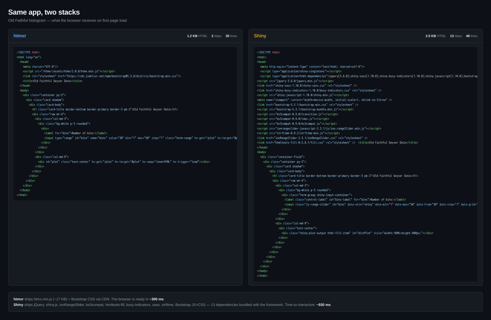
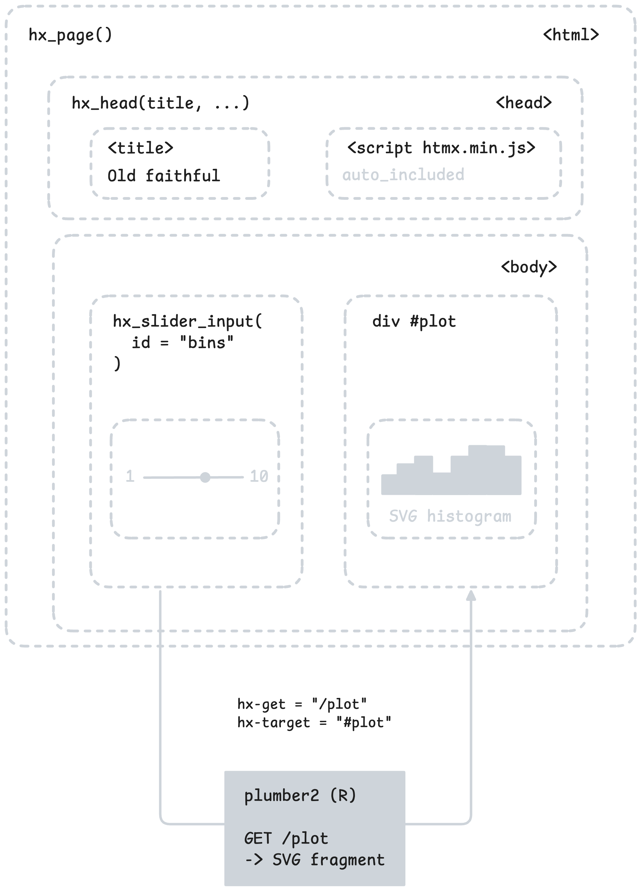
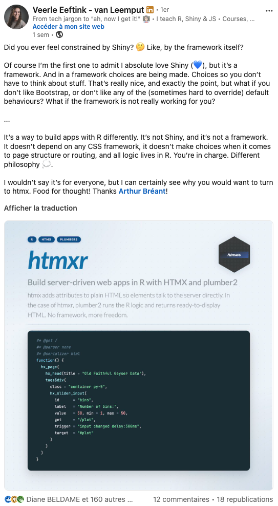

# Prologue

##  {.center}

::: {.r-fit-text}
**_"Ce que tu fais avec Shiny,
ce n'est pas du vrai web."_**
:::

::: {.fragment .attribution}
Mon ancien patron
:::

::: notes
Quand j'ai commencé R, avant ThinkR, mon patron m'a dit un jour :

'ce que tu fais avec Shiny, ce n'est pas du vrai web'.

J'étais vexé.
Je faisais des apps, elles tournaient dans un navigateur, des gens les utilisaient :
c'était quoi son problème ?
:::

## Quelques années plus tard... {.center}

::: notes
Quelques années plus tard, je comprends.

Il n'avait pas complètement raison :

-> Shiny est légitime, c'est ce qui m'a appris à coder interactif.

Mais il n'avait pas tort non plus :

Shiny ne fait pas du web au sens où le web a été conçu.
C'est une app desktop qui s'exécute dans un browser, avec R comme moteur.
:::

## Le déclic {.center}

::: {.fragment}
La _release_ de `{plumber2}` sur le CRAN !

&#x1F517; [Blog du Tidyverse](https://tidyverse.org/blog/2025/09/plumber2-0-1-0/){target="_blank"}
:::

::: notes
Déclic car pour moi c'est le package qui permet de faire du web
comme on l'entend avec des requêtes HTTP
et pleins de nouvelles fonctionnalités dont : async
:::

## &#x1F517; [htmx](https://htmx.org/){target="_blank"} ... htmxr {.center}

# htmxr

## htmxr

&#x1F525; `htmx` gère les interactions côté client via des attributs HTML.

&#x1F525; `plumber2` gère les points de terminaison R côté serveur.

\

::: {.fragment}
&#x1F680; `htmxr` fait le lien entre les deux grâce à :

- des fonctions d'aide R qui génèrent le code HTML approprié et,
- assurent l'interconnexion de l'ensemble.
:::

## &#x1F517; [hello.demo.hyperverse.world](https://hello.demo.hyperverse.world/){target="_blank"} {.center}

## Plutôt _fast_, hein ? &#x1F60F; {.center}

## Fast and furious

::: {.columns .center}
::: {.column width="50%"}
Application `htmxr` :

&#x1F517; [hello.demo.hyperverse.world](https://hello.demo.hyperverse.world/){target="_blank"}
:::
::: {.column width="50%"}
Applications `Shiny` :

_via Shinyproxy_ :
&#x1F517; [open-apps.breant.art/app/hello-shiny](https://open-apps.breant.art/app/hello-shiny){target="_blank"}

_via Posit Connect_ :
&#x1F517; [connect.thinkr.fr/hello-shiny](https://connect.thinkr.fr/hello-shiny/){target="_blank"}
:::
:::

## _fast and furious_, vraiment ? &#x1F914; {.center}

## {.center}

::: {.r-fit-text}
_Faire du web depuis R, le web comme il a été conçu_
:::

::: notes
Aujourd'hui je vous montre une autre façon de faire du web depuis R.

Pas mieux que Shiny, mais différente.

Une façon qui s'appuie sur les standards web :
HTTP, HTML, composants natifs du navigateur.

On va voir ce que ça donne en pratique, sur quelques métriques,
et ce que ça change économiquement.
:::

## La mécanique `htmxr`

```html
Navigateur                Serveur R
   │                          │
   │  ─── GET /plot ────►     │
   │                       (R génère du HTML)
   │  ◄─── <svg>...</svg>     │
   │                          │
 (DOM swap)
```

::: notes
htmxr, c'est ça :
HTTP standard. HTML standard.

Le navigateur demande, R répond du HTML.
htmx insère dans la page. Rien d'autre.

Pas de WebSocket, pas de session, pas de système réactif.
Juste le web tel qu'il a été conçu en 1990, depuis R.
:::

## Fast : chargement initial

-> **Où** : sur mon VPS directement.

-> **Outil** : Playwright.

-> **Quoi mesuré** : temps écoulé entre `page.goto(url)` et le moment où le plot `SVG/IMG` est réellement visible dans le DOM.

::: {.columns .center}
::: {.column width="50%"}
Application `htmxr` :

&#x1F517; [hello.demo.hyperverse.world](https://hello.demo.hyperverse.world/){target="_blank"}

&#x1F525;  0.3s
:::
::: {.column width="50%"}
Application `Shiny` :

&#x1F517; [open-apps.breant.art/app/hello-shiny](https://open-apps.breant.art/app/hello-shiny){target="_blank"}

&#x1F525;  0.9s
:::
:::


::: notes
Protocole

1. Warmup : 1 chargement de la page avant la mesure → cache navigateur
amorcé (Bootstrap CDN, assets Shiny, etc.)
2. Mesure : 5 runs, je prends la médiane (pas la moyenne — robuste aux
outliers)

Résultats bruts

┌─────────┬────────────┬────────────┐
│   Run   │ htmxr (ms) │ Shiny (ms) │
├─────────┼────────────┼────────────┤
│ 1       │ 296        │ 1200       │
├─────────┼────────────┼────────────┤
│ 2       │ 294        │ 891        │
├─────────┼────────────┼────────────┤
│ 3       │ 252        │ 974        │
├─────────┼────────────┼────────────┤
│ 4       │ 234        │ 934        │
├─────────┼────────────┼────────────┤
│ 5       │ 321        │ 871        │
├─────────┼────────────┼────────────┤
│ Médiane │ 294        │ 934        │
└─────────┴────────────┴────────────┘
:::

## Fast : interaction slider

-> **Où** : sur mon VPS directement.

-> **Quoi mesuré** : temps écoulé quand on bouge le slider

::: {.columns .center}
::: {.column width="50%"}
Application `htmxr` :

&#x1F517; [hello.demo.hyperverse.world](https://hello.demo.hyperverse.world/){target="_blank"}

&#x1F525;  Quasi instantané
:::
::: {.column width="50%"}
Application `Shiny` :

&#x1F517; [open-apps.breant.art/app/hello-shiny](https://open-apps.breant.art/app/hello-shiny){target="_blank"}

&#x1F525;  Micro délai
:::
:::

::: {.columns .center}
::: {.column width="50%"}
- le navigateur fait un `GET /plot?bins=X`,

- R génère un SVG en 12 ms.

- htmx swap dans le DOM.

-> Trois étapes, toutes standard.
:::
::: {.column width="50%"}
- nouvelle valeur via WebSocket,

- invalidation du graphe réactif,

- recalcul,

- rendu PNG, encodage base64,

- retour via WS,

- update DOM.

-> Sept étapes, dont plusieurs spécifiques à `Shiny`.
:::
:::

::: notes
Mon bench ne me donne pas le chiffre côté Shiny — hey ne mesure pas le WebSocket :

https://hub.docker.com/r/williamyeh/hey
:::


## Fast : poids client

_Pourquoi ces différences ?_  **Deps JS/CSS : 2 vs 13**

{.lightbox width="60%" fig-align="center"}

::: notes
Voici ce que les deux serveurs envoient au navigateur. À
gauche htmxr : 30 lignes de HTML

À droite Shiny : 48 lignes, et
surtout 13 dépendances dans le head — jquery, shiny.js, ionRangeSlider
qui réécrit le slider natif, bs3compat qui gère la rétrocompatibilité
Bootstrap 3, etc. La philosophie web standard : utiliser ce que le
navigateur sait déjà faire. Shiny a fait le choix opposé — réécrire les
composants en JS pour avoir un contrôle fin. Les deux choix sont
défendables. Mais on voit ici visuellement pourquoi le poids et la vitesse
divergent.
:::

## La conséquence économique {.center}

## Furious : l'asymétrie

::: {.columns .center}
::: {.column width="50%"}
`htmxr` (stateless HTTP)
──────────────────────

1 process R partagé

RAM &#x267E;&#xFE0F; requêtes actives

User inactif = gratuit
:::
::: {.column width="50%"}
`Shiny` (stateful WS)
─────────────────────

1 session R par user

RAM &#x267E;&#xFE0F; users connectés

User inactif = coûte
:::
:::

## Payer le travail réel ! {.center}

## Furious : la facture OVH

Avec mon VPS à 6.62 €/mois TTC :

→ 20 users `Shiny` en simultané (1 container/user)

→ 1000+ users `htmxr` (1 process pour tous)

\

À 500 users actifs :

`htmxr` → même VPS-1  → 6.62 € TTC/mois

`Shiny` → dédié RISE-1 64 GB →  ~78 € HT/mois

\

:::{.fragment}
&#x1F525; **HTTP est stateless par design : chaque requête est indépendante !**
:::

::: notes
C'est là que le modèle web standard paie. HTTP est
stateless par design — chaque requête est indépendante. Donc votre serveur
ne porte pas le coût des users connectés mais inactifs. Vous payez le
travail réel : une requête en cours, c'est de la mémoire ; un user qui idle
 sur sa page, c'est gratuit. Shiny fait l'inverse : chaque user connecté
pinne une session R en mémoire, même s'il regarde son téléphone pendant 10
minutes. La conséquence directe en facture OVH : pour 500 users actifs,
vous passez d'un dédié à 78 € HT/mois à un VPS à 6 € TTC. Source :
ovhcloud.com vérifié mai 2026
:::

## Furious : ce que tu hérites gratuitement

### `htmxr` = HTTP + HTML + composants natifs du navigateur

\

Ce que qu'on peut récupérer gratuitement :

→ **Cache HTTP**, **CDN**, replicas, **scaling horizontal**

→ **Monitoring** et debugging avec les outils web standard

→ Déployable n'importe où (Docker, VPS, k8s, serverless)

→ **URLs adressables**

→ on paie pour le travail, pas pour les sessions

# API REST (en accéléré)

## L'analogie du restaurant {.center}

::: {.columns}
::: {.column width="33%"}
**Client**

Tu commandes

:::
::: {.column width="33%"}
**Serveur (API)**

Il transmet

:::
::: {.column width="33%"}
**Cuisine (backend)**

Elle prépare
:::
:::

\

::: {.fragment}
Le client ne rentre jamais en cuisine.

Le serveur fournit un **menu** (la documentation).
:::

## L'API, c'est un contrat &#x1F91D;

::: {.columns}
::: {.column width="50%"}
**Le client s'engage à** :

- Envoyer une requête bien formée
- Respecter le format attendu
:::
::: {.column width="50%"}
**Le serveur s'engage à** :

- Répondre dans un format précis
- Renvoyer des codes prévisibles
:::
:::

\

::: {.fragment}
**Comme un menu de restaurant** : tu sais ce que tu commandes, à quel prix,
 en combien de temps.

**Comme un contrat juridique** : chacun connaît ses obligations.
:::

## L'interopérabilité : le pouvoir du contrat

### Une *seule* API. *N'importe quel* client.

\

::: {.fragment}
- Avec `htmxr`, un endpoint est consommable de partout : navigateur, curl, Python, JS, Go, ...

- Avec `Shiny`, une app n'est consommable **que** par un navigateur qui fait tourner Shiny.
:::

::: notes
C'est un argument stratégique majeur

Tu écris ta logique métier une fois en R, et tu peux la servir à tous tes consommateurs : un script Python qui veut les données, une app mobile, un export Excel, et bien sûr le navigateur via htmx.

Avec Shiny, si tu veux exposer la même logique à un autre client, tu dois écrire une seconde app

htmxr unifie tout.
:::

## Les verbes HTTP

| Verbe | Sens | Idempotent |
|---|---|---|
| `GET` | "donne-moi" | &#x2705; |
| `POST` | "voici qqch à créer" | &#x274C; |
| `PUT` | "remplace tout" | &#x2705; |
| `PATCH` | "modifie un bout" | &#x2705; |
| `DELETE` | "supprime" | &#x2705; |

\

::: {.fragment}
&#x1F525; **Règle d'or : chaque requête est indépendante.**

Le serveur ne se souvient pas de toi entre deux requêtes : c'est le _stateless_ qu'on a vu plus tôt.
:::

::: notes
Idempotent veut dire : appeler la même requête plusieurs fois produit le même résultat.

GET 10 fois → même réponse, aucun effet de bord.
POST 10 fois → 10 ressources créées (non idempotent).

C'est important pour les retries automatiques, le cache, etc.

Ne pas s'attarder sur idempotence si la salle a l'air à l'aise — c'est dans le tableau pour les seniors qui le veulent.
:::

## L'astuce htmx — démo live

```r
hx_run_example("json-endpoint")
```

\

Même donnée (`diamond_data()`), deux endpoints :

::: {.columns}
::: {.column width="50%"}
**`GET /api/rows`**

`#* @serializer json`

\

→ Pour curl, Python, mobile...
:::
::: {.column width="50%"}
**`GET /rows`**

`#* @serializer none` (HTML)

\

→ Pour htmx
:::
:::

::: {.fragment}
\

&#x1F525; **Même backend, deux clients.**

C'est `htmxr`: une API REST avec une sérialisation HTML pour le navigateur.
:::

::: notes
Démo en live :
1. Lance hx_run_example("json-endpoint") dans ta console
2. Ouvre /api/rows dans le navigateur → JSON brut
3. Ouvre / dans le navigateur → page interactive avec la même donnée
4. Inspecte le DOM : le tbody se met à jour quand on change le filtre cut

Phrase clé à dire :
"Vous écrivez votre logique métier une fois, et vous la servez dans le format
qui convient à chaque client. Avec Shiny, vous écrivez deux apps : une Shiny
pour les humains, une plumber pour les autres clients. Avec htmxr, c'est la
même API."

Pour les détails sur les attributs htmx (hx-get, hx-target, hx-swap, hx-trigger),
pointe vers getting-started.qmd sur hyperverse.world.
:::

# Shiny vs htmxr : synthèse

## Deux modèles de communication {.smaller}

|  | `Shiny` | `htmxr` |
|---|---|---|
| **Communication** | WebSocket (connexion persistante) | HTTP (requête / réponse) |
| **Paradigme** | Graphe réactif | Requêtes HTTP explicites |
| **Mises à jour UI** | Shiny décide quoi recharger | On cible le DOM précisément |
| **État** | Session R par utilisateur | Base de données ou URL |
| **Backend** | R uniquement | N'importe quel serveur HTTP |

::: notes
Le tableau est un récap visuel pour fixer ce qu'on a vu dans le bench.

Le point clé : ce ne sont pas deux versions du même modèle.
Ce sont DEUX MODÈLES DIFFÉRENTS de communication entre navigateur et serveur.

L'un (Shiny) garde le tuyau ouvert en permanence.
L'autre (hyperverse) ouvre, demande, ferme, recommence.

Conséquence : tout le reste découle de ce choix de communication.
:::

## Une phrase à retenir {.center}


### En `Shiny`, le serveur **réagit**,

### En `htmxr`, le navigateur **demande**.

::: notes
C'est LA phrase à graver. À répéter au micro.

Shiny est un modèle "push" — le serveur orchestre, décide quoi mettre à jour, et envoie au client.

htmxr est un modèle "pull" — c'est le client qui prend l'initiative et demande quand il a besoin.

Cette inversion d'initiative change tout :
- qui porte la complexité (serveur en Shiny, client en htmxr)
- comment ça scale (sessions vs requêtes)
- ce qu'on peut faire avec (apps internes vs apps publiques)
:::

# Présentation de htmxr

## Installation

```r
install.packages("htmxr")

# version de développement
pak::pak("hyperverse-r/htmxr")
```

\

::: {.fragment}
&#x1F4E6; `htmxr` Version actuelle : `v0.2.0`.

&#x1F517; Dépend de [`plumber2`](https://plumber2.posit.co/){target="_blank"} pour le serveur HTTP.
:::

::: notes
Rappel : htmxr est sur le CRAN, donc accessible à tout dev R sans bricolage.

Mentionne aussi que plumber2 est requis — c'est le serveur HTTP qui exécute les routes annotées que tu vas voir.

Si quelqu'un demande la différence avec plumber v1 : plumber2 a l'async, des routes plus modulaires, et un meilleur support des serializers HTML.
:::

## Le cycle htmx en 4 étapes

::: {.columns}
::: {.column width="40%"}
{.lightbox fig-align="center" width="80%"}

:::
::: {.column width="60%"}
1. Un événement déclenche
2. `htmx` envoie une requête HTTP
3. Le serveur renvoie un **fragment HTML**
4. `htmx` insère le fragment dans le DOM
:::
:::

::: notes
Utilise l'image intro_htmxr.png du README de htmxr — elle illustre exactement ce cycle.

Insiste sur "fragment HTML" : c'est le pivot. Pas du JSON à parser, pas du DOM à reconstruire — du HTML déjà prêt à coller dans la page.

Aucune ligne de JavaScript écrite par toi. Pour un dev R qui ne veut pas apprendre JS, c'est libérateur.

Pour les détails complets : pointe vers getting-started.qmd sur hyperverse.world.
:::

## Cinq attributs HTML, cinq paramètres R

| Attribut HTML | Paramètre `htmxr` | Rôle |
|---|---|---|
| `hx-get` | `get` | requête `GET` |
| `hx-post` | `post` | requête `POST` |
| `hx-target` | `target` | sélecteur CSS cible |
| `hx-swap` | `swap` | mode d'insertion |
| `hx-trigger` | `trigger` | événement déclencheur |

\

::: {.fragment}
&#x1F4A1; Chaque attribut HTML de htmx correspond à un paramètre dans `htmxr`.

Tu écris du R, `htmxr` génère le HTML avec les bons attributs.
:::

::: notes
Ce sont les 5 attributs qu'ils vont voir dans le TD.

Le mapping 1:1 est crucial : aucune magie, juste de la traduction R → HTML.

Pour les variantes (outerHTML, afterend, modificateurs comme delay:300ms ou from:body...) : pointer vers getting-started.qmd.
:::

## Helpers : la structure d'une page

::: {.columns}
::: {.column width="40%"}
- `hx_page()` &#x2192; document HTML complet
- `hx_head()` &#x2192; section `<head>`

\

&#x1F4A1; `hx_page()` injecte automatiquement le `<script>` qui charge `htmx.min.js`.
:::
::: {.column width="60%"}
```r
#* @get /
#* @parser none
#* @serializer html
function() {
  hx_page(
    hx_head(
      title = "Ma page"
    ),
    tags$div(
      class = "container",
      tags$h1("Bonjour")
    )
  )
}
```
:::
:::

::: {.fragment}
&#x1F4D6; **Les annotations `plumber2`** :

- `#* @get /` &#x2192; cette fonction répond aux requêtes `GET /`
- `#* @parser none` &#x2192; pas de parsing du body (inutile pour un `GET`)
- `#* @serializer html` &#x2192; le résultat est sérialisé en HTML
:::

::: notes
hx_page() est l'équivalent de fluidPage() côté Shiny : le wrapper de page complète.

hx_head() gère la balise head : titre, CSS, meta, etc.

Les annotations plumber2 :
- @get / : route qui répond à GET sur l'URL racine
- @parser none : on désactive le parsing automatique du body de la requête (pas utile pour GET)
- @serializer html : on dit à plumber2 de sérialiser le résultat en HTML (par défaut c'est JSON)

C'est exactement le pattern qu'ils verront partout dans le TD : route page + serializer html.

Insiste : htmxr est CSS-agnostique. Tu charges le CSS que tu veux à la main
(Bootstrap, DaisyUI, Pico, rien du tout...). Pas de framework imposé.

Si quelqu'un demande "pourquoi serializer html plutôt que json" : c'est exactement
l'astuce htmx qu'on a vue plus tôt — au lieu de renvoyer des données brutes,
on renvoie du HTML directement insérable dans la page.
:::

## Helpers : les composants d'input

::: {.columns}
::: {.column width="40%"}
- `hx_slider_input()` &#x2192; `<input type="range">`
- `hx_select_input()` &#x2192; `<select>`
- `hx_button()` &#x2192; `<button>`

\

&#x1F4A1; Chaque composant accepte les **5 paramètres htmx** (`get`, `target`, `trigger`...).

\

::: {.fragment}
&#x1F9E0; Composants d’input conçus pour **ressembler aux composants `Shiny`** (`sliderInput`, `selectInput`), pour faciliter la transition mentale.
:::
:::
::: {.column width="60%"}
```r
hx_slider_input(
  id = "bins",
  label = "Nombre de bins :",
  value = 30,
  min = 1,
  max = 50,
  get = "/plot",
  trigger = "input changed delay:300ms",
  target = "#plot"
)
```
:::
:::

::: notes
Pattern unique : chaque composant prend des params standards (id, label, value...)
+ les 5 params htmx pour câbler la requête au serveur.

Ils sont conçus pour ressembler aux composants Shiny (sliderInput, selectInput),
pour faciliter la transition mentale des Shiny devs.
:::

## Helpers : augmenter n'importe quel tag

::: {.columns}
::: {.column width="40%"}
&#x1F31F; **`hx_set()`** = le helper le plus puissant.

\

Il ajoute les attributs `hx-*` sur **n'importe quel tag htmltools**.

\

Utile pour transformer un `<div>`, `<a>`, `<span>`... existant en cible htmx.
:::
::: {.column width="60%"}
```r
tags$div(id = "plot") |>
  hx_set(
    get = "/plot",
    trigger = "load",
    target = "#plot",
    swap = "innerHTML"
  )
```

:::
:::

::: notes
hx_set() est ta backdoor : quand aucun composant htmxr ne correspond à ton besoin,
tu prends un tag htmltools brut et tu lui ajoutes les attributs htmx via pipe.

C'est ce qui rend htmxr extensible : tout package qui produit du htmltools
(bslib, htmxr.bootstrap, n'importe quoi) peut être augmenté en composant htmx
avec hx_set().
:::

## Helpers : les tables

::: {.columns}
::: {.column width="40%"}
- `hx_table()` &#x2192; squelette `<table>` avec `<tbody>` ciblable
- `hx_table_rows()` &#x2192; fragment de lignes `<tr>`

\

&#x1F4A1; Pattern courant : la page renvoie le squelette, un endpoint séparé renvoie les rows.
:::
::: {.column width="60%"}
```r
# Dans la page
hx_table(
  columns = c("nom", "prix"),
  tbody_id = "tbody",
  get = "/rows",
  trigger = "load"
)

# Dans le fragment endpoint
#* @get /rows
#* @serializer none
function() {
  hx_table_rows(
    data,
    columns = c("nom", "prix")
  )
}
```
:::
:::

::: notes
Pattern à montrer rapidement — ils vont le retrouver dans json-endpoint et select-input.

Le squelette de table est servi avec la page. Le tbody se met à jour
indépendamment via un fragment endpoint dédié. C'est le pattern le plus
utilisé pour les tableaux dynamiques en htmxr.
:::

## Organisation d'un fichier `api.R`

::: {.columns}
::: {.column width="50%"}
```r
library(htmxr)

# ── Route page complète ─────────────────
#* @get /
#* @parser none
#* @serializer html
function() {
  hx_page(
    hx_head(title = "Ma première app"),
    tags$div(
      id = "content"
    ) |>
      hx_set(
        get = "/content",
        trigger = "load",
        target = "#content"
      )
  )
}

# ── Route fragment HTML ─────────────────
#* @get /content
#* @parser none
#* @serializer html
function() {
  tags$p("Bonjour depuis le serveur !")
}
```
:::
::: {.column width="50%"}
::: {.fragment}
::: {.callout-warning}
**Pour une app complexe, ce schéma ne suffit pas.**

Un équivalent de [`golem`](https://thinkr-open.github.io/golem/){target="_blank"} / [`rhino`](https://appsilon.github.io/rhino/){target="_blank"} reste à imaginer pour standardiser modules, tests, déploiement.
:::
:::
:::
:::

::: notes
Deux types de routes dans tous tes apps htmxr :

1. GET / — la page complète (hx_page + hx_head + structure)
   → serializer html

2. GET /fragment — le fragment HTML qui se charge dynamiquement
   → serializer html (ou none si tagList)

Tu peux avoir N routes fragment. Chacune correspond à une zone dynamique
de ta page.

Le @parser none désactive le parsing automatique du body — pour les GET on n'en a pas besoin.

Sur le warning :
Sois transparent sur le fait que l'organisation d'une "vraie" app n'est
pas encore standardisée. C'est un sujet ouvert de l'écosystème. Pour
l'instant, chacun trouve sa convention.

L'idée d'un équivalent golem/rhino pour htmxr est notée dans la roadmap.
Mentionner que c'est un appel à contributions implicite — si quelqu'un
veut y travailler, c'est ouvert.

Citer golem est aussi un clin d'œil à ThinkR (Colin et son équipe le maintiennent).
Ça montre que tu connais leur écosystème et que tu n'es pas en croisade contre eux.
:::

## Lancer l'API

```r
library(plumber2)
library(htmxr)

api("api.R") |>
  hx_serve_assets() |>
  (\(pr) pr$ignite(block = TRUE))()
```

\

::: {.fragment}
- `api()` &#x2192; lit `api.R` et crée le routeur plumber2
- `hx_serve_assets()` &#x2192; sert `htmx.min.js` comme asset statique
- `ignite()` &#x2192; démarre le serveur HTTP
:::

\

::: {.fragment}
&#x1F4A1; **Pour tester un exemple sans rien écrire** :

```r
hx_run_example("infinity-scroll")
```
:::

::: notes
3 étapes pour lancer une app htmxr :

1. plumber2::api() lit le fichier api.R et crée le routeur
2. hx_serve_assets() ajoute la route /htmxr/assets/... qui sert htmx.min.js
3. pr$ignite() démarre le serveur sur le port par défaut (8080)

Pour les démos rapides : hx_run_example("nom") fait tout ça automatiquement
avec un des exemples livrés dans le package.

Liste les exemples : hx_run_example() sans argument affiche les choix disponibles.
:::

# TD

## On code ! &#x1F468;&#x200D;&#x1F4BB; {.center}

## Exercice 1

Récupérer [les fichiers Gist](https://gist.github.com/ArthurData/fb4a9e67bb116e01f682415e3f5a7abb){target="_blank"} :

- `api.R`

- `run_api.R`

::: {.fragment}
\

#### Todo :

&#x1F532; Lancer l'API pour faire tourner l'application

&#x1F41B; L'application se lance mais le slider ne réagit pas...
:::

::: {.fragment}
&#x1F532; Câbler le slider

```r
hx_slider_input(
  id = "bins",
  label = "Number of bins:",
  value = 30,
  min = 1,
  max = 50,
  get = "???",        # ← URL de l'endpoint à appeler
  trigger = "input changed delay:300ms",
  target = "???",     # ← sélecteur CSS de l'élément à mettre à jour
  class = "form-range"
)
```
:::

## Pour aller plus loin... &#x1F61C;

Reproduire :

```r
hx_run_example("select-input")
```

# CSS-agnostique

## `htmxr` ne force aucun framework CSS

Dans `hello/api.R` :

```r
bootstrap_css <- tags$link(
  rel = "stylesheet",
  href = "https://cdn.jsdelivr.net/npm/bootstrap@5.3.8/dist/css/bootstrap.min.css",
  ...
)

hx_page(
  hx_head(
    title = "Old Faithful Geyser Data",
    bootstrap_css   # ← chargé à la main
  ),
  ...
)
```

::: {.fragment}
&#x1F4A1; **Commenter ces 4 lignes** &#x2192; l'app reste fonctionnelle, juste sans style.
:::

::: notes
Le point clé : Bootstrap est chargé à la main via CDN, dans une variable
qu'on injecte dans hx_head().

C'est un choix conscient. Tu pourrais charger :
- Pico CSS (classless, minimal)
- DaisyUI (composants prêts)
- Tailwind (utility-first)
- Aucun CSS (juste du HTML brut)

htmxr ne te dit rien — c'est toi qui décides.

Pour comparer : un shinyApp() charge bslib + Bootstrap d'office. Tu ne peux
pas y échapper sans bidouilles très techniques.
:::

## `Shiny` vs `htmxr` : le `<head>` rappel

{.lightbox width="50%" fig-align="center"}

\

::: {.fragment}
À gauche : **2 dépendances** (`htmx.min.js` + Bootstrap CSS).

À droite : **13 dépendances** dont la moitié... ne sont pas Bootstrap.
:::

## Le coût caché de `Shiny`

`Shiny` (et `bslib`) complète Bootstrap par-dessus.

\

Classes spécifiques qu'on retrouve dans le DOM Shiny :

```html
<div class="form-group shiny-input-container">
 ...
</div>
```

::: {.fragment}
&#x274C; `shiny-input-container` &#x2192; **inventions `Shiny`**, pas Bootstrap.
:::

\

::: {.fragment}
&#x274C; `.form-group` &#x2192; abandonné par Bootstrap 5, réinjecté par shiny pour rétro-compatibilité.

```css
.form-group {
  margin-bottom: 1em;
}
```

&#x1F914; **Conséquence** : la doc Bootstrap officielle ne correspond pas à ce que tu vois dans le DOM.
:::

## La voie simple : `htmxr.bootstrap` {.center}

## La voie simple : `htmxr.bootstrap`

```r
api("api.R") |>
  hx_bs_serve_assets() |>   # ← htmx.js + Bootstrap CSS/JS
  (\(pr) pr$ignite(block = TRUE))()

#* @get /
#* @serializer html
function() {
  hx_bs_page(            # ← injecte Bootstrap automatiquement
    hx_bs_button("save", "Enregistrer", post = "/save", target = "#status")
  )
}
```

\

::: {.fragment}
&#x2705; **Bootstrap pur** : classes officielles, doc Bootstrap directement applicable
:::

::: {.fragment}
Exploration :
```r
htmxr.bootstrap::hx_bs_run_example("hello")
```
:::

::: notes
htmxr.bootstrap est la surcouche Bootstrap "pure" :
- hx_bs_page() injecte Bootstrap automatiquement (CSS + JS)
- hx_bs_serve_assets() sert htmx.js + Bootstrap

L'avantage : pas de réécriture custom. Les classes sont 100% Bootstrap.
Tu lis la doc Bootstrap, tu utilises les classes Bootstrap, ça marche.

Honnêteté : le package est encore en dev, il y a des bugs notamment sur
hx_bs_theme() (theming Sass). Les ThinkR seniors vont apprécier ta lucidité —
mieux vaut le dire toi-même qu'eux le découvrent et te le reprochent en Q&A.

L'objectif à terme : htmxr.bootstrap au CRAN, mature. Mais pas encore.
:::

# Le coût du roundtrip

## Avez-vous remarqué ? {.center}

&#x1F517; [hello.demo.hyperverse.world](https://hello.demo.hyperverse.world/){target="_blank"}

::: {.fragment}
La valeur du slider ne s'affiche **pas** à côté du curseur.
:::

::: {.fragment}
&#x1F4A1; Comment l'afficher ?
:::

## Option naïve : roundtrip serveur

```r
#* @get /slider-value
#* @query bins:integer(30)
#* @serializer html
function(query) {
  tags$span(query$bins)
}
```

\

::: {.fragment}
&#x274C; 50 requêtes/seconde quand l'utilisateur bouge le slider.

&#x274C; Tout ça pour... **afficher un nombre déjà connu côté client**.
:::

::: notes
On pourrait câbler le slider pour qu'il appelle aussi /slider-value en plus
de /plot, avec un target multi-swap sur deux zones.

Ça marcherait. Mais c'est ABSURDE :
- 50 req/sec pendant que le user bouge le slider
- Charge serveur, charge réseau, batterie mobile
- Le navigateur connaît déjà la valeur (c'est lui qui l'a)
- On lui demande de la renvoyer au serveur pour qu'il la lui renvoie

C'est un anti-pattern qu'on voit souvent quand on n'a que htmx comme outil.
:::

## Option élégante : `alpiner` (Alpine.js)

```r
library(alpiner)
x_run_example("hello")
```

\

::: {.fragment}
&#x2705; Même app que tout à l'heure, **avec la valeur du slider en live**.

&#x2705; **Zéro requête HTTP** pour cet affichage : tout côté client.
:::

::: notes
Démo en live : lance x_run_example("hello") dans ta console R avant la slide.

Tu projettes l'app à côté de tes slides. Bouge le slider — la valeur s'affiche
instantanément, même quand tu bouges très vite. Aucune requête réseau.

C'est le "wow" visuel : ils voient que c'est plus réactif que le hello d'avant,
et tu vas leur montrer dans la slide suivante que c'est 3 lignes de code.
:::

## Les 3 lignes magiques

```r
tags$div(

  hx_slider_input(
    id = "bins",
    ...,
    `x-model.number` = "bins"           # ← 1. binding bidirectionnel
  ),

  tags$span() |> x_set(text = "bins")   # ← 2. affichage réactif

) |> x_set(data = "{ bins: 30 }")       # ← 3. scope Alpine
```

\

::: {.fragment}
&#x1F4A1; **`x-model.number`** = binding bidirectionnel typé number.

**`x_set(text = "bins")`** = le contenu du span suit `bins`.

**`x_set(data = ...)`** = déclare le scope réactif Alpine.
:::

::: notes
Reviens sur la slide précédente après avoir montré la démo, et là tu décortiques.

Les 3 ingrédients :

1. x_set(data = "{ bins: 30 }") sur le wrapper : déclare un scope Alpine
   avec une variable bins initialisée à 30.

2. x-model.number sur l'input du slider : binding bidirectionnel. Quand
   l'utilisateur bouge, bins est mis à jour automatiquement (en number).

3. x_set(text = "bins") sur le span : le contenu du span suit la valeur
   de bins. Quand bins change, le span se met à jour.

Aucune requête au serveur. Aucune session R. Juste du JavaScript déclaratif.

Note pédagogique pour les Shiny devs : c'est l'équivalent d'un `observeEvent`
côté client, mais déclaratif et avec une syntaxe HTML. Pas besoin de
JavaScript imperatif.
:::

## La règle d'or

### **`htmxr`** quand il faut un **aller-retour serveur**,
### **`alpiner`** quand c'est purement **visuel / client**.

\

::: {.fragment}
&#x1F525; Trois packages, trois rôles :

- `htmxr` &#x2192; interactivité serveur (DOM &#x2194; R)
- `alpiner` &#x2192; interactivité client (sans R)
- `htmxr.bootstrap` (ou daisy, etc.) &#x2192; composants stylés prêts à l'emploi
:::

::: notes
C'est la slide à graver.

Tu peux la formuler au micro :
"htmx quand il faut taper le serveur. Alpine quand c'est purement visuel."

Le triptyque htmxr + alpiner + htmxr.bootstrap est la composition idiomatique
d'une app hyperverse complète.

Si quelqu'un demande "et React/Vue ?" : tu réponds "hors-scope, ces frameworks
proposent un autre paradigme (SPA stateful). Alpine est minimal, déclaratif,
HTML-native — c'est le modèle qui rime avec htmx."

Si quelqu'un demande "et si j'ai besoin de plus que ce qu'Alpine fait ?" :
tu réponds "tu peux toujours écrire du JS custom — htmxr et alpiner ne te
l'interdisent pas. Mais Alpine couvre 90% des besoins client avec des
directives lisibles."
:::


# `glitchtipr`

## Error tracking en R

::: {.columns}
::: {.column width="50%"}
**Le problème**

\

En prod, `stop("...")` génère un `simpleError`.

Tes logs : tout est `simpleError`.

Impossible de filtrer, prioriser, alerter.
:::
::: {.column width="50%"}
**La solution**

\

[**GlitchTip**](https://glitchtip.com/){target="_blank"} : error tracking open source, self-hostable, compatible API Sentry.

[**glitchtipr**](https://github.com/hyperverse-r/glitchtipr){target="_blank"} : le wrapper R (en dev).
:::
:::

\

::: {.fragment}
```r
library(glitchtipr)

gt <- gt_connect()  # reads GLITCHTIP_DSN — inactive if not set

#* @capture
#* @get /plot
#* @parser none
#* @serializer none
function(request, query) {
  generate_plot(query$bins %||% 30)
}
```
:::

::: notes
GlitchTip est open source (MIT) et auto-hébergeable. C'est l'alternative open
source à Sentry. Compatible API Sentry, donc tu peux utiliser les SDK Sentry
existants — c'est ce que glitchtipr fera côté R.

Statut glitchtipr : encore au stade d'idée, pas encore publié. Mais le
hello.demo a déjà une intégration custom qui démontre le pattern. C'est ce
qu'on va voir en démo.

Le point pédagogique majeur : `stop("...")` nu crée un simpleError. En prod,
tous tes incidents ont le même type, c'est ingérable. La discipline rlang::abort
avec une class typée transforme l'observabilité R.

Tu peux mentionner que cette discipline est aussi utile sans GlitchTip — c'est
juste de la bonne hygiène pour le développement R.
:::

## Démo live {.center}

#### [hello.demo.hyperverse.world/plot?bins=a](https://hello.demo.hyperverse.world/plot?bins=a){target="_blank"}


\

::: {.fragment}
&#x1F4A5; Erreur côté serveur &#x2192; remontée dans GlitchTip &#x2192; visible dans la dashboard.
:::

::: notes
Avant la slide :
1. Ouvre l'URL hello.demo.hyperverse.world/plot?bins=a dans le navigateur
   (ça génère une erreur car bins doit être un integer)
2. Ouvre la dashboard GlitchTip dans un autre onglet (glitchtip.breant.art)

Pendant la slide :
1. Tu projettes l'URL d'erreur, tu cliques
2. Tu montres le 500 retourné
3. Tu bascules sur GlitchTip
4. L'erreur apparaît dans la dashboard avec :
   - Le type d'erreur (avec class si tu as utilisé rlang::abort)
   - Le stacktrace
   - Le contexte (route, query, headers)

Punchline à dire :
"Dans 30 secondes, sur une vraie app en prod, vous savez ce qui s'est passé,
où, et combien d'autres users en ont souffert. Sans grep dans les logs."

Caveat : tu peux mentionner que glitchtipr lui-même n'est pas encore publié.
L'intégration que tu montres est artisanale dans le hello.demo, mais elle
préfigure ce que sera le package.
:::

## On en parle...

::: {.columns .center}
::: {.column width="50%"}
{.lightbox width="50%" fig-align="center"}
:::
::: {.column width="50%"}
\

> _It’s a way to build apps with R differently. It’s not Shiny, and it’s not a framework. It doesn’t depend on any CSS framework, it doesn’t make choices when it comes to page structure or routing, and all logic lives in R. You’re in charge. Different philosophy 💭_
:::
:::

# The web way {.center}

**_Faire du web depuis R, le web comme il a été conçu._**

## Hyperverse

&#x1F4D6; Documentation officielle : [hyperverse.world](https://hyperverse.world){target="_blank"}

# Merci {.center}

# hyperverse {style="text-align: center; font-size:2.2em"}
